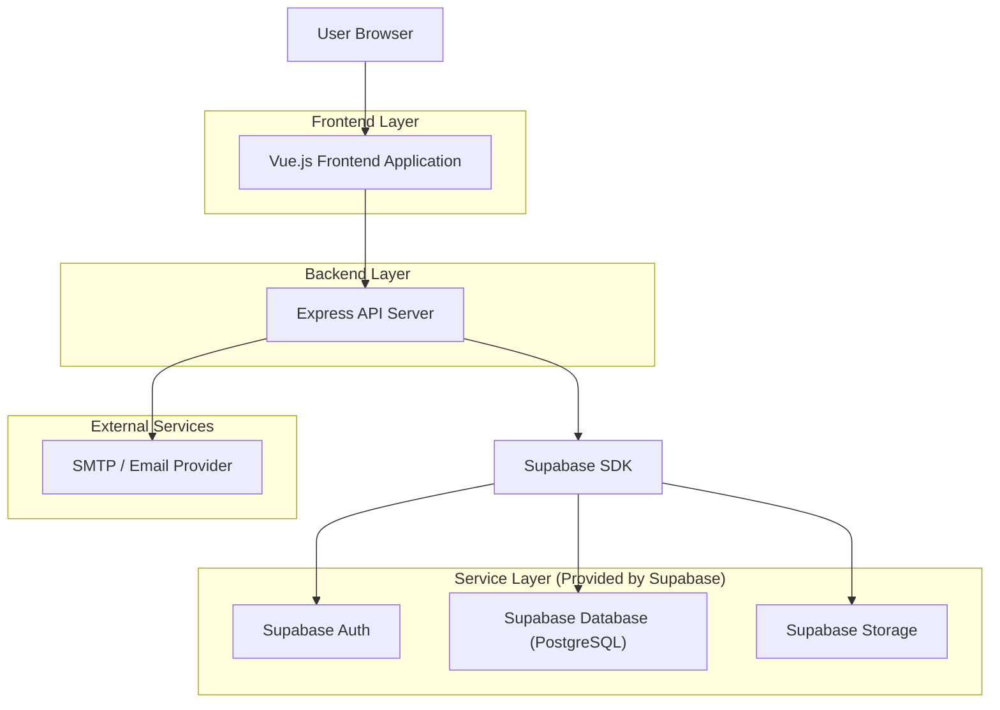
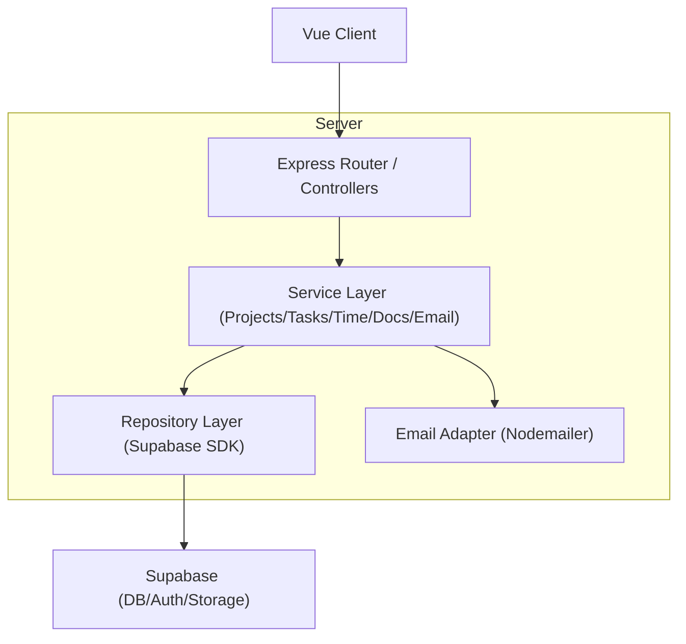
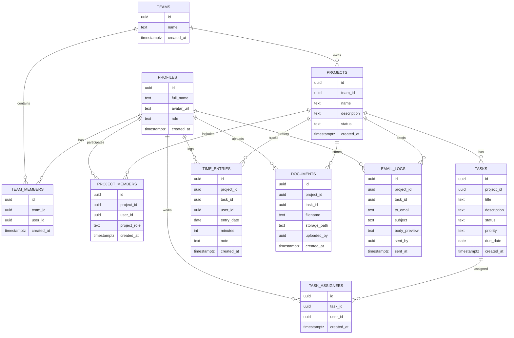

## 1.Architecture design


## 2.Technology Description
- Frontend: Vue@3 + TypeScript + vue-router + pinia + vite + tailwindcss@3 + postcss + autoprefixer
- Backend: Express@4 + TypeScript + supabase-js + zod (validación) + nodemailer (envío de correo)
- Database/Storage/Auth: Supabase (PostgreSQL + Storage + Auth Google OAuth)

Notas de UI/estilos y build (frontend)
- Tailwind se compila con PostCSS dentro de Vite (sin pasos extra de bundler).
- Configuración: `tailwind.config.*` con `content` apuntando a `index.html` y `src/**/*.{vue,ts,tsx}`; tokens en `theme.extend`.
- Entrada CSS: `src/assets/main.css` (o equivalente) con `@tailwind base; @tailwind components; @tailwind utilities;`.
- Modo oscuro: `darkMode: 'class'` (clase en `html`/`body`) para consistencia entre páginas.

## 3.Route definitions
| Route | Purpose |
|-------|---------|
| /login | Login con Google y estado de sesión |
| / | Inicio / Panel con lista de proyectos y resumen |
| /projects/:projectId | Espacio de trabajo del proyecto (tareas, tiempos, docs, correos) |
| /teams-time | Gestión de equipos y vista de registro de tiempos |

## 4.API definitions (If it includes backend services)
### 4.1 Shared TypeScript types (core)
```ts
export type ID = string; // UUID

export type Role = 'admin' | 'member';

export type Project = {
  id: ID;
  name: string;
  description?: string;
  status: 'active' | 'archived';
  createdAt: string;
};

export type TaskStatus = 'backlog' | 'todo' | 'in_progress' | 'done';

export type Task = {
  id: ID;
  projectId: ID;
  title: string;
  description?: string;
  status: TaskStatus;
  priority: 'low' | 'medium' | 'high';
  dueDate?: string;
  createdAt: string;
};

export type TimeEntry = {
  id: ID;
  projectId: ID;
  taskId?: ID;
  userId: ID;
  date: string; // YYYY-MM-DD
  minutes: number;
  note?: string;
  createdAt: string;
};

export type DocumentItem = {
  id: ID;
  projectId: ID;
  taskId?: ID;
  filename: string;
  storagePath: string;
  uploadedBy: ID;
  createdAt: string;
};

export type EmailLog = {
  id: ID;
  projectId: ID;
  taskId?: ID;
  to: string;
  subject: string;
  bodyPreview: string;
  sentBy: ID;
  sentAt: string;
};
```

### 4.2 Core API (Express)
Auth
- GET /api/auth/google/start → redirige a OAuth Google (via Supabase Auth)
- GET /api/auth/google/callback → crea sesión (cookie httpOnly) y redirige a /
- POST /api/auth/logout → elimina sesión
- GET /api/me → devuelve usuario y rol

Projects
- GET /api/projects
- POST /api/projects (admin)
- GET /api/projects/:projectId

Tasks
- GET /api/projects/:projectId/tasks
- POST /api/projects/:projectId/tasks
- PATCH /api/tasks/:taskId

Assignments
- PUT /api/tasks/:taskId/assignees

Time
- GET /api/time-entries?projectId&userId&from&to
- POST /api/time-entries
- DELETE /api/time-entries/:timeEntryId

Documents
- GET /api/projects/:projectId/documents
- POST /api/projects/:projectId/documents (subida + metadatos)
- GET /api/documents/:documentId/download

Email
- POST /api/projects/:projectId/emails/send (envía y registra)
- GET /api/projects/:projectId/emails

## 5.Server architecture diagram (If it includes backend services)


## 6.Data model(if applicable)
### 6.1 Data model definition


### 6.2 Data Definition Language
Profiles (profiles)
```sql
CREATE TABLE profiles (
  id UUID PRIMARY KEY,
  full_name TEXT,
  avatar_url TEXT,
  role TEXT NOT NULL DEFAULT 'member' CHECK (role IN ('admin','member')),
  created_at TIMESTAMPTZ NOT NULL DEFAULT NOW()
);

CREATE INDEX idx_profiles_role ON profiles(role);

ALTER TABLE profiles ENABLE ROW LEVEL SECURITY;

-- Lectura/escritura solo autenticados (políticas orientativas)
CREATE POLICY profiles_select_own ON profiles
FOR SELECT TO authenticated
USING (id = auth.uid());

CREATE POLICY profiles_upsert_own ON profiles
FOR INSERT TO authenticated
WITH CHECK (id = auth.uid());

CREATE POLICY profiles_update_own ON profiles
FOR UPDATE TO authenticated
USING (id = auth.uid())
WITH CHECK (id = auth.uid());
```

Projects (projects) + Members (project_members)
```sql
CREATE TABLE projects (
  id UUID PRIMARY KEY DEFAULT gen_random_uuid(),
  team_id UUID,
  name TEXT NOT NULL,
  description TEXT,
  status TEXT NOT NULL DEFAULT 'active' CHECK (status IN ('active','archived')),
  created_at TIMESTAMPTZ NOT NULL DEFAULT NOW()
);

CREATE TABLE project_members (
  id UUID PRIMARY KEY DEFAULT gen_random_uuid(),
  project_id UUID NOT NULL,
  user_id UUID NOT NULL,
  project_role TEXT NOT NULL DEFAULT 'member' CHECK (project_role IN ('admin','member')),
  created_at TIMESTAMPTZ NOT NULL DEFAULT NOW()
);

CREATE INDEX idx_project_members_project ON project_members(project_id);
CREATE INDEX idx_project_members_user ON project_members(user_id);

ALTER TABLE projects ENABLE ROW LEVEL SECURITY;
ALTER TABLE project_members ENABLE ROW LEVEL SECURITY;
```

Tasks (tasks) + Assignees (task_assignees)
```sql
CREATE TABLE tasks (
  id UUID PRIMARY KEY DEFAULT gen_random_uuid(),
  project_id UUID NOT NULL,
  title TEXT NOT NULL,
  description TEXT,
  status TEXT NOT NULL DEFAULT 'todo' CHECK (status IN ('backlog','todo','in_progress','done')),
  priority TEXT NOT NULL DEFAULT 'medium' CHECK (priority IN ('low','medium','high')),
  due_date DATE,
  created_at TIMESTAMPTZ NOT NULL DEFAULT NOW()
);

CREATE TABLE task_assignees (
  id UUID PRIMARY KEY DEFAULT gen_random_uuid(),
  task_id UUID NOT NULL,
  user_id UUID NOT NULL,
  created_at TIMESTAMPTZ NOT NULL DEFAULT NOW()
);

CREATE INDEX idx_tasks_project ON tasks(project_id);
CREATE INDEX idx_task_assignees_task ON task_assignees(task_id);
CREATE INDEX idx_task_assignees_user ON task_assignees(user_id);

ALTER TABLE tasks ENABLE ROW LEVEL SECURITY;
ALTER TABLE task_assignees ENABLE ROW LEVEL SECURITY;
```

Time entries (time_entries)
```sql
CREATE TABLE time_entries (
  id UUID PRIMARY KEY DEFAULT gen_random_uuid(),
  project_id UUID NOT NULL,
  task_id UUID,
  user_id UUID NOT NULL,
  entry_date DATE NOT NULL,
  minutes INT NOT NULL CHECK (minutes > 0),
  note TEXT,
  created_at TIMESTAMPTZ NOT NULL DEFAULT NOW()
);

CREATE INDEX idx_time_entries_project ON time_entries(project_id);
CREATE INDEX idx_time_entries_user_date ON time_entries(user_id, entry_date DESC);

ALTER TABLE time_entries ENABLE ROW LEVEL SECURITY;
```

Documents (documents) + Email logs (email_logs)
```sql
CREATE TABLE documents (
  id UUID PRIMARY KEY DEFAULT gen_random_uuid(),
  project_id UUID NOT NULL,
  task_id UUID,
  filename TEXT NOT NULL,
  storage_path TEXT NOT NULL,
  uploaded_by UUID NOT NULL,
  created_at TIMESTAMPTZ NOT NULL DEFAULT NOW()
);

CREATE TABLE email_logs (
  id UUID PRIMARY KEY DEFAULT gen_random_uuid(),
  project_id UUID NOT NULL,
  task_id UUID,
  to_email TEXT NOT NULL,
  subject TEXT NOT NULL,
  body_preview TEXT NOT NULL,
  sent_by UUID NOT NULL,
  sent_at TIMESTAMPTZ NOT NULL DEFAULT NOW()
);

CREATE INDEX idx_documents_project ON documents(project_id);
CREATE INDEX idx_email_logs_project ON email_logs(project_id);

ALTER TABLE documents ENABLE ROW LEVEL SECURITY;
ALTER TABLE email_logs ENABLE ROW LEVEL SECURITY;
```

Permisos (orientativo)
```sql
GRANT USAGE ON SCHEMA public TO anon, authenticated;
GRANT SELECT ON ALL TABLES IN SCHEMA public TO authenticated;
GRANT INSERT, UPDATE, DELETE ON ALL TABLES IN SCHEMA public TO authenticated;
```
