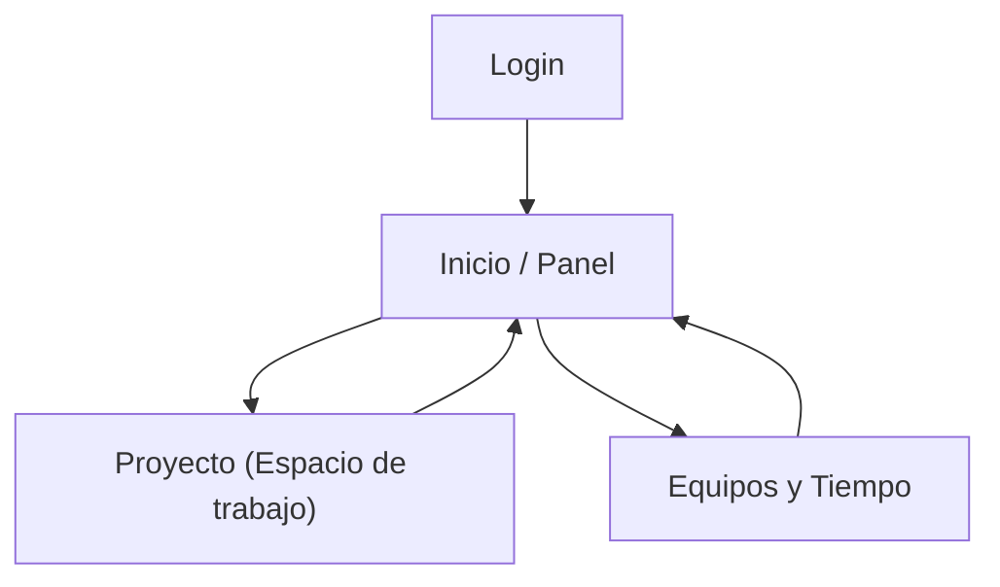

## 1. Product Overview
Gestor tipo Jira para planificar proyectos, organizar tareas y coordinar equipos con seguimiento de tiempo.
Centraliza asignaciones, registro de horas y envío/archivo de documentos y correos, con login Google.

## 2. Core Features

### 2.1 User Roles
| Role | Registration Method | Core Permissions |
|------|---------------------|------------------|
| Administrador | Login con Google (Supabase Auth) | Crear/editar proyectos y equipos, gestionar miembros, configurar permisos, ver todos los tiempos y comunicaciones |
| Miembro | Login con Google (Supabase Auth) | Ver proyectos asignados, gestionar/actualizar tareas, registrar tiempos, subir/descargar documentos, enviar correos vinculados al proyecto |

### 2.2 Feature Module
El producto se compone de las siguientes páginas principales:
1. **Inicio / Panel**: acceso rápido, lista de proyectos, resumen de tareas y tiempos.
2. **Proyecto (Espacio de trabajo)**: tablero/lista de tareas, asignaciones, tiempos, documentos y correos del proyecto.
3. **Equipos y Tiempo**: gestión de equipos/miembros y vista de registros de horas.
4. **Login**: acceso con Google.

### 2.3 Page Details
| Page Name | Module Name | Feature description |
|-----------|-------------|---------------------|
| Login | Google Sign-in | Iniciar sesión con Google y crear sesión de usuario.
| Login | Session handling | Redirigir al panel si ya hay sesión; cerrar sesión.
| Inicio / Panel | Navegación | Navegar a proyectos, equipos/tiempos y cerrar sesión.
| Inicio / Panel | Proyectos | Listar proyectos visibles; buscar por nombre; crear proyecto (admin).
| Inicio / Panel | Resumen | Mostrar “mis tareas” (por estado) y horas registradas recientes.
| Proyecto (Espacio de trabajo) | Contexto del proyecto | Ver información básica; cambiar entre tablero/lista.
| Proyecto (Espacio de trabajo) | Tareas | Crear/editar tareas (título, descripción, estado, prioridad, fecha); mover entre estados; comentar; adjuntar documentos.
| Proyecto (Espacio de trabajo) | Asignaciones | Asignar/desasignar miembros a tareas; ver carga básica por persona.
| Proyecto (Espacio de trabajo) | Tiempos | Registrar tiempo por tarea (fecha, duración, nota); editar/eliminar propio registro.
| Proyecto (Espacio de trabajo) | Documentos | Subir/descargar archivos del proyecto; vincular a tarea (opcional).
| Proyecto (Espacio de trabajo) | Correos | Redactar y enviar correo vinculado al proyecto/tarea; guardar historial del envío.
| Equipos y Tiempo | Equipos | Crear/editar equipos (admin); añadir/quitar miembros; listar miembros.
| Equipos y Tiempo | Registro de tiempo | Filtrar tiempos por proyecto/miembro/rango de fechas; exportación básica (CSV).

## 3. Core Process
**Flujo de autenticación**
1) Entras a Login y pulsas “Continuar con Google”.
2) Se completa OAuth y vuelves autenticado; el sistema crea/actualiza tu perfil.
3) Accedes al Inicio/Panel.

**Flujo de gestión de proyecto (Admin)**
1) En Inicio/Panel creas un proyecto y seleccionas el equipo/miembros.
2) Abres el Proyecto (Espacio de trabajo) y creas tareas.
3) Asignas tareas a miembros y adjuntas documentos si aplica.
4) Envías correos desde el contexto del proyecto/tarea y queda registro.

**Flujo de trabajo diario (Miembro)**
1) En Inicio/Panel revisas “mis tareas”.
2) Entras al proyecto, actualizas estados y comentas.
3) Registras tiempo contra una tarea y subes/descargas documentos necesarios.

## 4. Requisitos no funcionales
- Frontend: Vue.js 3 + TypeScript + Tailwind CSS (PostCSS + autoprefixer).
- Build frontend: Vite; CSS generado por Tailwind (content scan) y modo oscuro por clase.
- Backend: Express (API) con TypeScript.
- Datos, auth y archivos: Supabase (Postgres, Auth con Google, Storage).
- Envío de correos: vía API (proveedor SMTP o servicio transaccional) y registro del envío en Supabase.
- Seguridad: RLS activado y políticas por pertenencia a proyecto/equipo.
